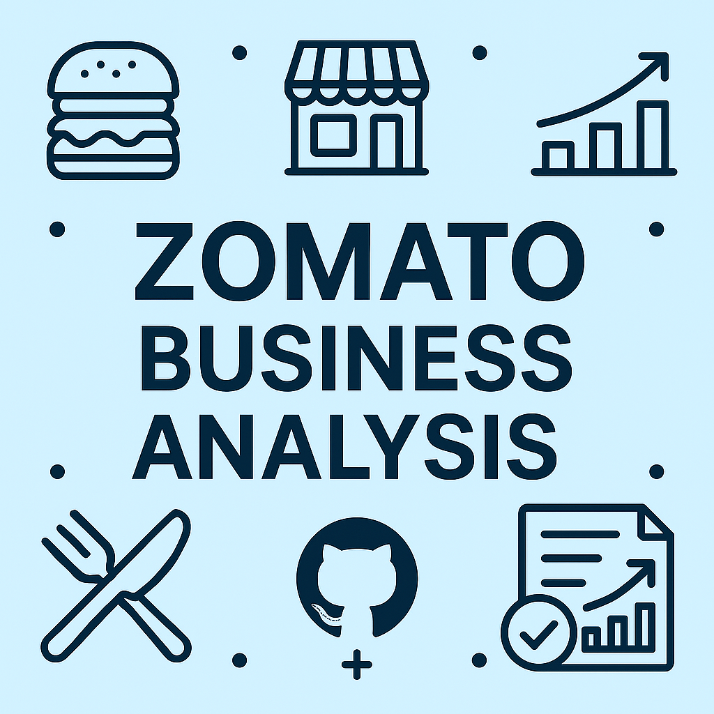
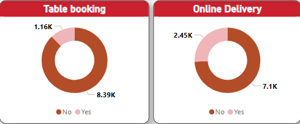

# 🍔 Zomato Business Analysis Project

 **"An insightful dashboard analyzing Zomato's business patterns and restaurant performance."**

 **Zomato Business Analysis** is an interactive analytics project built using **Power BI** and real-world Zomato restaurant data. The dashboard and accompanying reports offer clear visualizations of key insights into restaurant trends, customer preferences, and operational performance. It's designed for restaurateurs, food industry analysts, and decision-makers to quickly grasp complex food delivery and dining data.

 ---

 ## 🌐 View Live Projec

 👉 [View Report](https://zomato-analysis.netlify.app/)
 👉 [View Dashboard](https://lookerstudio.google.com/reporting/54eba0b5-ef36-484e-8c48-96c2ff3bbff9)
 ---

 ## 🖼️ Cover Page

 

 ---

 ## ✨ Features

 - **📊 Visual Storytelling:** Understand trends in restaurant ratings, average costs, and online ordering behavior.
 - **📌 Detailed Dashboards:** Summary, overview, and deep-dive views powered by Power BI.
 - **🌍 Geographic Insights:** Heatmaps show regional restaurant density and performance.
 - **🍽️ Cuisine Analysis:** Breakdowns of popular cuisines and their impact on business.
 - **📈 Rating & Cost Trends:** Analyze the relationship between restaurant ratings and average cost.
 - **📤 Exportable Reports:** Includes PDF and HTML formats for presentations and sharing.
 - **💡 Actionable Insights:** Designed to help stakeholders make informed decisions regarding restaurant strategies and market positioning.

 ## 📁 Project Structure

```

D:.
├───assets
│       avg_cost.png
│       avg_rat.png
│       cover_image.png
│       cuisine.png
│       favicon.png
│       geographic.png
│       snapshot.jpg
│       table_online.png
│
├───data
│       zomato_data.xlsx
│
├───powerBI
│       zomato_insights_dashboard.pbix
│
└───reports
        index.html
        summary.pdf
        zomato_analysis_comprehensive_report.pdf

```

## 🧪 Setup & Usage

1. **Open Power BI File:**

   Open `powerBI/zomato_insights_dashboard.pbix` with [Power BI Desktop](https://powerbi.microsoft.com/desktop).

2. **Explore Dataset:**

   Raw dataset used: `data/zomato_data.xlsx`.

3. **View Reports:**

   - 📄 PDF: `reports/zomato_analysis_comprehensive_report.pdf`
   - 🌐 HTML Summary: `reports/index.html`

---

## 📷 Screenshots

### 🔹 Zomato Dashboard Snapshot


### 🔹 Table Booking & Online Order Analysis


---

## 👨‍💻 Developer

**Faisal Khan**

- 🌐 [Portfolio](https://khanfaisal.netlify.app)
- 💻 [GitHub](https://github.com/khanfaisal79960)
- 🔗 [LinkedIn](https://www.linkedin.com/in/khanfaisal79960)
- ✍️ [Medium](https://medium.com/@khanfaisal79960)
- 📷 [Instagram](https://instagram.com/mr._perfect_1004)

---

> Crafted with 📊 by Faisal Khan.
